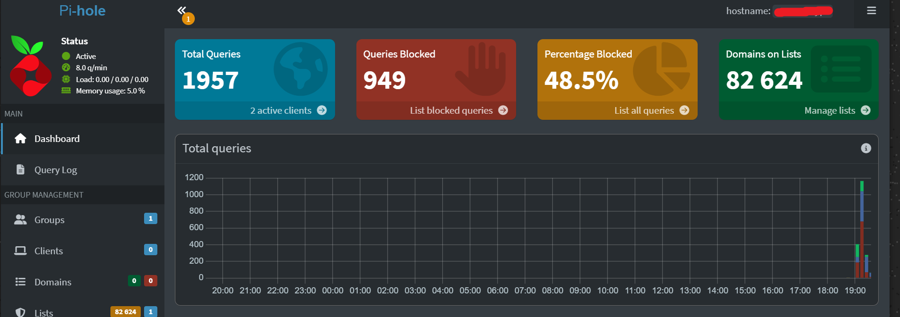
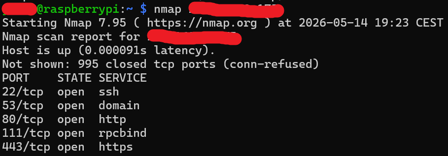

# raspberry-pi-pihole-dns-lab
Raspberry Pi network lab with Pi-hole DNS filtering, DHCP reservation, DNS tests and basic nmap scanning.

# Raspberry Pi Pi-hole DNS Filtering Lab

## Overview

This project documents the configuration of a Raspberry Pi as a local DNS filtering server using Pi-hole.  
The lab includes SSH access, DHCP reservation, Pi-hole installation, Windows DNS configuration, DNS query testing and basic network scanning with nmap.

The goal of the project was to understand how DNS works in a local network and how DNS-level filtering can be used to block advertising, tracking and unwanted domains.

---

## Lab Environment

- Raspberry Pi with Raspberry Pi OS
- Windows PC as a client device
- Home router with DHCP enabled
- Pi-hole as local DNS filtering service
- nmap for basic network scanning

Example network topology:

```text
Windows PC → Router → Raspberry Pi / Pi-hole → Upstream DNS → Internet

## Screenshots

### Pi-hole Dashboard



The Pi-hole dashboard shows that the server is actively processing DNS queries from local clients. In this setup, Pi-hole processed 1916 DNS queries and blocked 949 of them, resulting in a 49.5% block rate.

### nmap Service Scan



The nmap scan identified the following open TCP ports on the Raspberry Pi:

```text
22/tcp   open  ssh
53/tcp   open  domain
80/tcp   open  http
111/tcp  open  rpcbind
443/tcp  open  https
